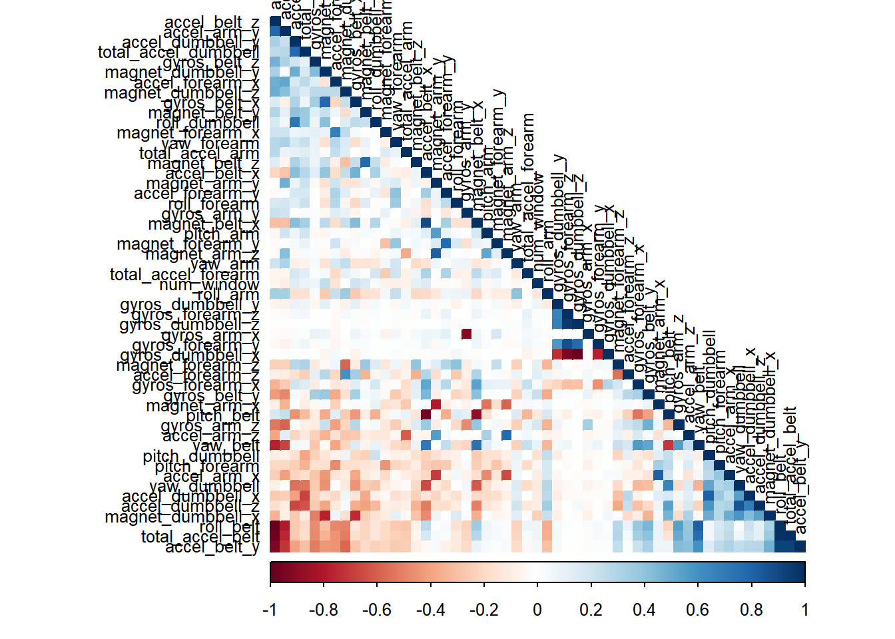
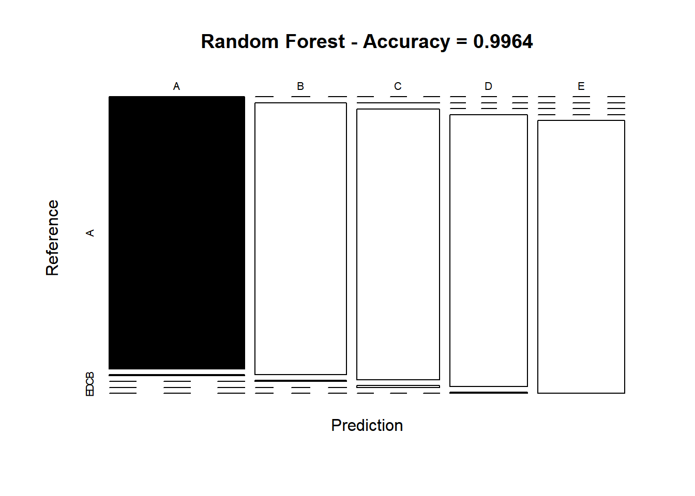
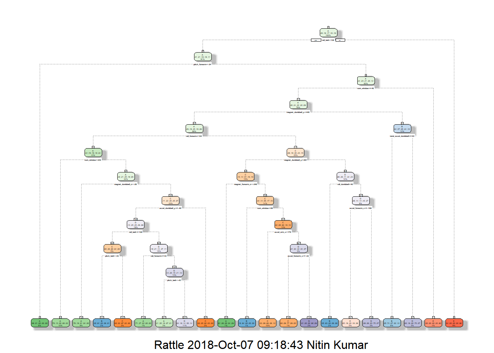
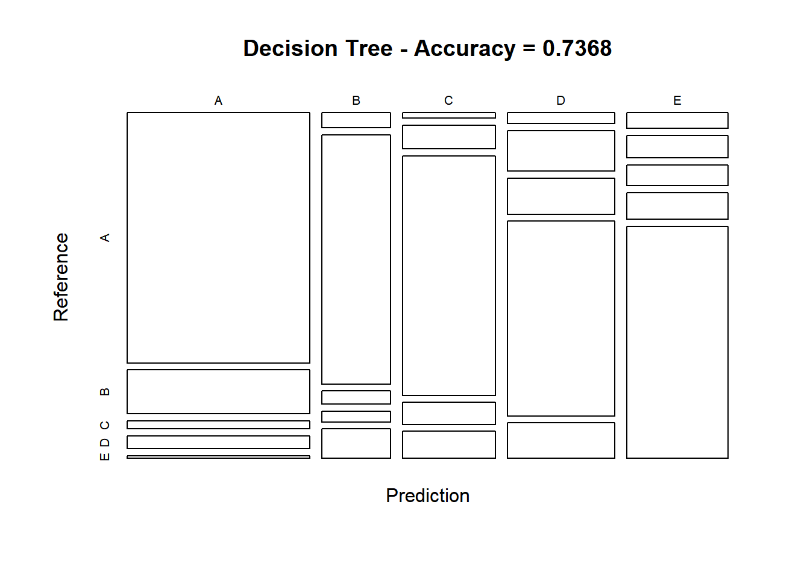
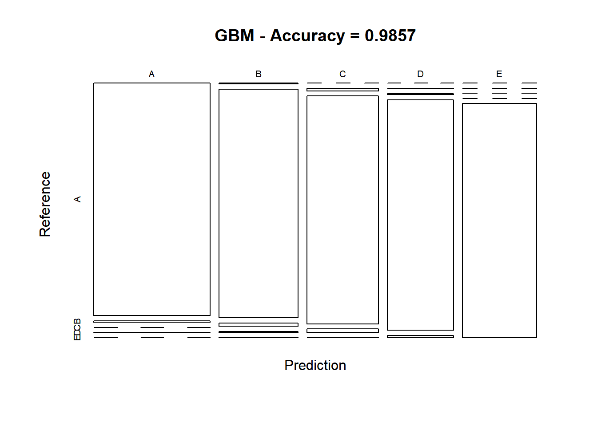

## Overview
Practical Machine Learning Coursera's course project as part of the specialization in Data science. It is built up in Rstudio, using knitr function. The Goal of project is to predict the manner in which 6 participants performed excercise. Using devices such as Jawbone Up, Nike FuelBand, and Fitbit it is now possible to collect a large amount of data about personal activity relatively inexpensively. These type of devices are part of the quantified self movement - a group of enthusiasts who take measurements about themselves regularly to improve their health, to find patterns in their behavior, or because they are tech geeks. One thing that people regularly do is quantify how much of a particular activity they do, but they rarely quantify how well they do it. Project goal will be to use data from accelerometers on the belt, forearm, arm, and dumbell of 6 participants. They were asked to perform barbell lifts correctly and incorrectly in 5 different ways.

## Setting Environment and Loading data
Uploading the R libraries that are necessary for the analysis.

```r
library(knitr)
library(caret)
library(rpart)
library(rpart.plot)
library(rattle)
library(randomForest)
library(corrplot)

set.seed(12345)
```

## Getting and cleaning Data
The next step is loading the dataset from the Given URL. 

```r
# setting the URL for the download
TrainUrl <- "http://d396qusza40orc.cloudfront.net/predmachlearn/pml-training.csv"
TestUrl  <- "http://d396qusza40orc.cloudfront.net/predmachlearn/pml-testing.csv"

# downloadng the datasets
training <- read.csv(url(TrainUrl))
testing  <- read.csv(url(TestUrl))

# create a partition with the training dataset 
inTrain  <- createDataPartition(training$classe, p=0.7, list=FALSE)
TrainSet <- training[inTrain, ]
TestSet  <- training[-inTrain, ]
dim(TrainSet)
```

```
## [1] 13737   160
```

```r
dim(TestSet)
```

```
## [1] 5885  160
```
Both datasets have plenty of NA values, that we will remove. 

```r
# removeing  variables with Nearly Zero Variance
Nearzero <- nearZeroVar(TrainSet)
TrainSet <- TrainSet[, -Nearzero]
TestSet  <- TestSet[, -Nearzero]
dim(TrainSet)
```

```
## [1] 13737   106
```

```r
dim(TestSet)
```

```
## [1] 5885  106
```


```r
# removing variables that are mostly NA
NAval    <- sapply(TrainSet, function(x) mean(is.na(x))) > 0.95
TrainSet <- TrainSet[, NAval==FALSE]
TestSet  <- TestSet[, NAval==FALSE]
dim(TrainSet)
```

```
## [1] 13737    59
```

```r
dim(TestSet)
```

```
## [1] 5885   59
```


```r
# removeing identification variables (columns 1 to 5)
TrainSet <- TrainSet[, -(1:5)]
TestSet  <- TestSet[, -(1:5)]
dim(TrainSet)
```

```
## [1] 13737    54
```

```r
dim(TestSet)
```

```
## [1] 5885   54
```
After cleaning process we have 54  variables.

## Correlation Analysis

```r
corAnalysis <- cor(TrainSet[, -54])
corrplot(corAnalysis, order = "FPC", method = "color", type = "lower", 
         tl.cex = 0.8, tl.col = rgb(0, 0, 0))
```



The highly correlated variables are in dark colors in graph. 

## Building Prediction Models. 
Three methods will be applied to model the regression in the train data set and the best one with higher accuracy when applied to the Test dataset) will be used for prediction 
The methods are: (i) Random Forest (ii) Decision Tree (iii) Generalized Boosted model. 

## (i) Method: Random Forest

```r
# model fit
set.seed(12345)
controlRF <- trainControl(method="cv", number=3, verboseIter=FALSE)
modFitRandForest <- train(classe ~ ., data=TrainSet, method="rf",
                          trControl=controlRF)
modFitRandForest$finalModel
```

```
## 
## Call:
##  randomForest(x = x, y = y, mtry = param$mtry) 
##                Type of random forest: classification
##                      Number of trees: 500
## No. of variables tried at each split: 27
## 
##         OOB estimate of  error rate: 0.2%
## Confusion matrix:
##      A    B    C    D    E  class.error
## A 3904    1    0    0    1 0.0005120328
## B    6 2649    2    1    0 0.0033860045
## C    0    4 2391    1    0 0.0020868114
## D    0    0    7 2245    0 0.0031083481
## E    0    0    0    5 2520 0.0019801980
```


```r
# prediction on Test dataset
predictRandForest <- predict(modFitRandForest, newdata=TestSet)
confMatRandForest <- confusionMatrix(predictRandForest, TestSet$classe)
confMatRandForest
```

```
## Confusion Matrix and Statistics
## 
##           Reference
## Prediction    A    B    C    D    E
##          A 1674    5    0    0    0
##          B    0 1133    4    0    0
##          C    0    1 1022    7    0
##          D    0    0    0  957    4
##          E    0    0    0    0 1078
## 
## Overall Statistics
##                                           
##                Accuracy : 0.9964          
##                  95% CI : (0.9946, 0.9978)
##     No Information Rate : 0.2845          
##     P-Value [Acc > NIR] : < 2.2e-16       
##                                           
##                   Kappa : 0.9955          
##  Mcnemar's Test P-Value : NA              
## 
## Statistics by Class:
## 
##                      Class: A Class: B Class: C Class: D Class: E
## Sensitivity            1.0000   0.9947   0.9961   0.9927   0.9963
## Specificity            0.9988   0.9992   0.9984   0.9992   1.0000
## Pos Pred Value         0.9970   0.9965   0.9922   0.9958   1.0000
## Neg Pred Value         1.0000   0.9987   0.9992   0.9986   0.9992
## Prevalence             0.2845   0.1935   0.1743   0.1638   0.1839
## Detection Rate         0.2845   0.1925   0.1737   0.1626   0.1832
## Detection Prevalence   0.2853   0.1932   0.1750   0.1633   0.1832
## Balanced Accuracy      0.9994   0.9969   0.9972   0.9960   0.9982
```


```r
# plot matrix results
plot(confMatRandForest$table, col = confMatRandForest$byClass, 
     main = paste("Random Forest - Accuracy =",
                  round(confMatRandForest$overall['Accuracy'], 4)))
```



## (ii) Method: Decision Tree

```r
# model fit
set.seed(12345)
modFitDecTree <- rpart(classe ~ ., data=TrainSet, method="class")
fancyRpartPlot(modFitDecTree)
```




```r
# prediction on Test dataset
predictDecTree <- predict(modFitDecTree, newdata=TestSet, type="class")
confMatDecTree <- confusionMatrix(predictDecTree, TestSet$classe)
confMatDecTree
```

```
## Confusion Matrix and Statistics
## 
##           Reference
## Prediction    A    B    C    D    E
##          A 1530  269   51   79   16
##          B   35  575   31   25   68
##          C   17   73  743   68   84
##          D   39  146  130  702  128
##          E   53   76   71   90  786
## 
## Overall Statistics
##                                          
##                Accuracy : 0.7368         
##                  95% CI : (0.7253, 0.748)
##     No Information Rate : 0.2845         
##     P-Value [Acc > NIR] : < 2.2e-16      
##                                          
##                   Kappa : 0.6656         
##  Mcnemar's Test P-Value : < 2.2e-16      
## 
## Statistics by Class:
## 
##                      Class: A Class: B Class: C Class: D Class: E
## Sensitivity            0.9140  0.50483   0.7242   0.7282   0.7264
## Specificity            0.9014  0.96650   0.9502   0.9100   0.9396
## Pos Pred Value         0.7866  0.78338   0.7543   0.6131   0.7305
## Neg Pred Value         0.9635  0.89051   0.9422   0.9447   0.9384
## Prevalence             0.2845  0.19354   0.1743   0.1638   0.1839
## Detection Rate         0.2600  0.09771   0.1263   0.1193   0.1336
## Detection Prevalence   0.3305  0.12472   0.1674   0.1946   0.1828
## Balanced Accuracy      0.9077  0.73566   0.8372   0.8191   0.8330
```


```r
# plot matrix results
plot(confMatDecTree$table, col = confMatDecTree$byClass, 
     main = paste("Decision Tree - Accuracy =",
                  round(confMatDecTree$overall['Accuracy'], 4)))
```



##(iii) Method: Generalized Boosted Model

```r
# model fit
set.seed(12345)
controlGBM <- trainControl(method = "repeatedcv", number = 5, repeats = 1)
modFitGBM  <- train(classe ~ ., data=TrainSet, method = "gbm",
                    trControl = controlGBM, verbose = FALSE)
modFitGBM$finalModel
```

```
## A gradient boosted model with multinomial loss function.
## 150 iterations were performed.
## There were 53 predictors of which 41 had non-zero influence.
```


```r
# prediction on Test dataset
predictGBM <- predict(modFitGBM, newdata=TestSet)
confMatGBM <- confusionMatrix(predictGBM, TestSet$classe)
confMatGBM
```

```
## Confusion Matrix and Statistics
## 
##           Reference
## Prediction    A    B    C    D    E
##          A 1670   11    0    2    0
##          B    4 1115   16    5    2
##          C    0   12 1006   16    1
##          D    0    1    4  941   10
##          E    0    0    0    0 1069
## 
## Overall Statistics
##                                           
##                Accuracy : 0.9857          
##                  95% CI : (0.9824, 0.9886)
##     No Information Rate : 0.2845          
##     P-Value [Acc > NIR] : < 2.2e-16       
##                                           
##                   Kappa : 0.9819          
##  Mcnemar's Test P-Value : NA              
## 
## Statistics by Class:
## 
##                      Class: A Class: B Class: C Class: D Class: E
## Sensitivity            0.9976   0.9789   0.9805   0.9761   0.9880
## Specificity            0.9969   0.9943   0.9940   0.9970   1.0000
## Pos Pred Value         0.9923   0.9764   0.9720   0.9843   1.0000
## Neg Pred Value         0.9990   0.9949   0.9959   0.9953   0.9973
## Prevalence             0.2845   0.1935   0.1743   0.1638   0.1839
## Detection Rate         0.2838   0.1895   0.1709   0.1599   0.1816
## Detection Prevalence   0.2860   0.1941   0.1759   0.1624   0.1816
## Balanced Accuracy      0.9973   0.9866   0.9873   0.9865   0.9940
```


```r
# plot matrix results
plot(confMatGBM$table, col = confMatGBM$byClass, 
     main = paste("GBM - Accuracy =", round(confMatGBM$overall['Accuracy'], 4)))
```



## Applying the best accuracy Model to the the Test Data
The accuracy of the 3 regression modeling methods above are:
(i) Random Forest : 0.9963
(ii) Decision Tree : 0.7368
(iii) GBM : 0.9839
The Random Forest Model have the highest accuracy hence it will be applied to predict the Test dataset. 


```r
predictTEST <- predict(modFitRandForest, newdata=testing)
predictTEST
```

```
##  [1] B A B A A E D B A A B C B A E E A B B B
## Levels: A B C D E
```
